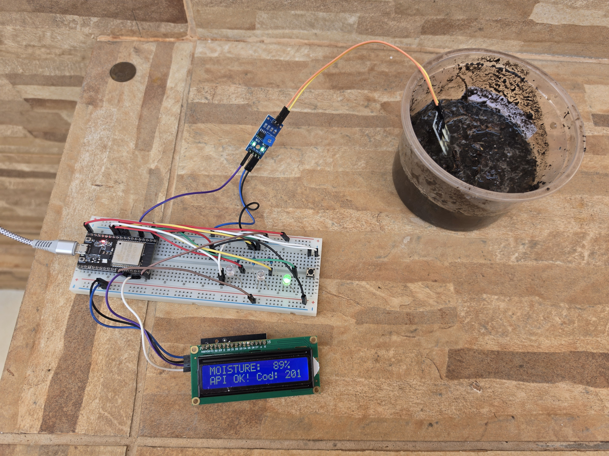

# AgroAqua - ESP32 Soil Moisture Telemetry Node

Firmware for the ESP32 microcontroller responsible for reading soil moisture levels and transmitting telemetry data to the AgroAqua Spring Boot API.

## Hardware Components Used
- 1x Breadboard (Protoboard) 830 points
- 1x Red LED
- 1x Yellow LED
- 1x Green LED
- 3x Resistor 200 Ohms (Ω)
- 1x Push Button
- 1x LCD 16x2 (I2C)
- 1x ESP32s NodeMCU (ESP-WROOM-32)
- 1x Resistive Soil Moisture Sensor
- 1x Comparator Module LM393
- Jumper wires

## Hardware Pinout

| Component | Component Pin | ESP32 Pin | Description |
| :--- | :--- | :--- | :--- |
| **Soil Moisture Sensor** | `AO` (Analog) | `GPIO 34` | ADC1 channel (compatible with active Wi-Fi) |
| **LCD 16x2 (I2C)** | `SDA` / `SCL` | `GPIO 21` / `GPIO 22` | Local telemetry display (`0x27` address) |
| **Green LED** | Anode (+) / Cathode (-) | `GPIO 25` / `GND` | Connected in series with a 200Ω resistor |
| **Yellow LED** | Anode (+) / Cathode (-) | `GPIO 26` / `GND` | Connected in series with a 200Ω resistor |
| **Red LED** | Anode (+) / Cathode (-) | `GPIO 27` / `GND` | Connected in series with a 200Ω resistor |
| **Push Button** | Terminal 1 / Terminal 2 | `GPIO 14` / `GND` | Manual trigger (uses internal `INPUT_PULLUP`) |

> **Wiring Note:** Each of the three LEDs must have a **200 Ohms (Ω) resistor** connected in series between its **Cathode (-)** leg and the breadboard **GND** rail to limit current. The Push Button does not require an external resistor because `GPIO 14` is configured with the ESP32's internal pull-up resistor (`INPUT_PULLUP`).

## Configuration & Authentication

1. Register a new sensor in the AgroAqua API via `POST /api/sensor` (requires Admin Authority JWT).
2. Copy the generated `id` and `rawApiKey` from the API response.
3. Open `SensorConfigurationModel.ino` and update the configuration constants:
   ```cpp
   const char* WIFI_SSID = "YOUR_WIFI_NAME";
   const char* WIFI_PASSWORD = "YOUR_WIFI_PASSWORD";
   const char* API_URL = "http://YOUR_LOCAL_IP:8080/api/measurement";

   const long SENSOR_ID = 1; // Change to your sensor ID
   const String rawApiKey = "YOUR_SENSOR_API_KEY";
   ```
4. Take it to the location of use and connect it to a stable power source.
5. The sensor will perform a measurement at startup and at 10-minute intervals. It can be activated outside the automatic cycle by pressing the action button. Ten seconds after the measurement, the display and LEDs will turn off; they will reactivate with each measurement.

## Working Prototype

*Prototype operating in real soil, displaying an 89% moisture reading and HTTP `201 Created` confirmation from the Spring Boot API.*